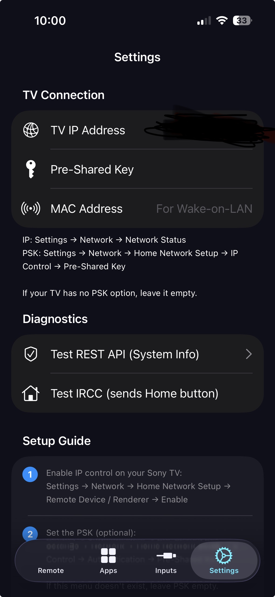
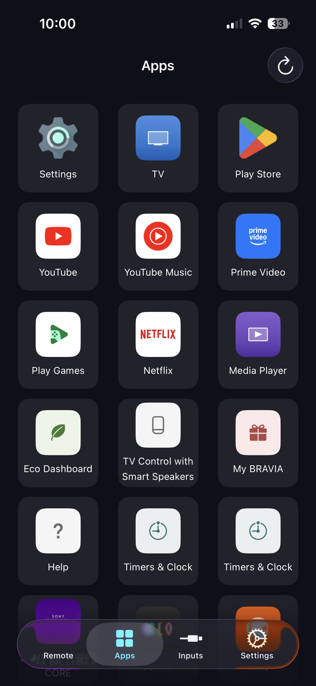
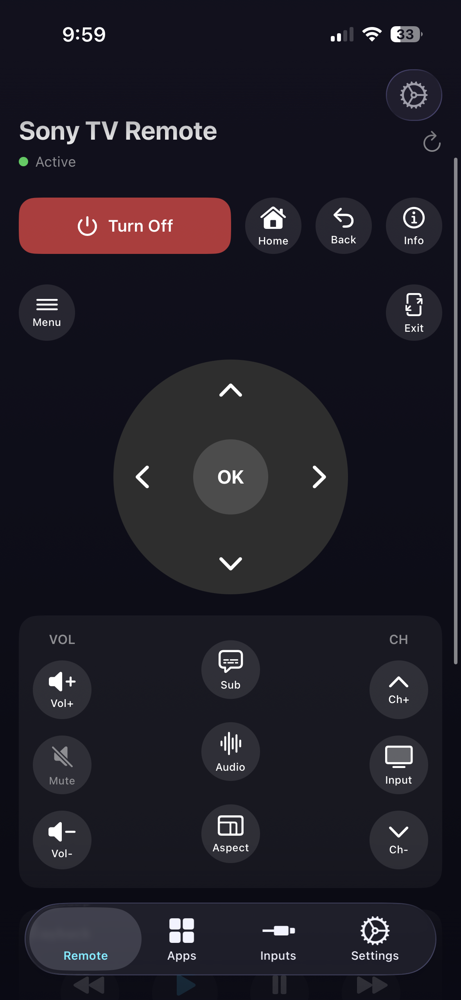
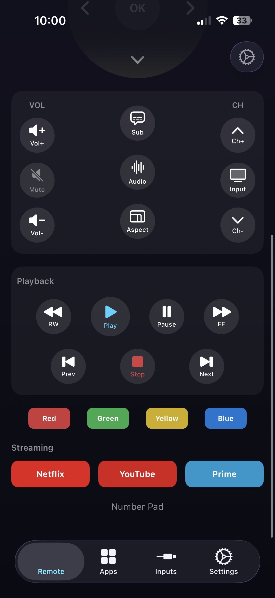

# Sony TV Remote

A native iOS remote for Sony Bravia/Android TVs using Sony's IRCC and REST APIs. Control power, navigation, volume, playback, inputs, and apps from a clean SwiftUI interface.

## Screenshots

Place the screenshots in `docs/screenshots/` with the filenames below.

| Remote | Apps | Inputs |
| --- | --- | --- |
|  |  |  |

| Settings | Remote (Playback) |
| --- | --- |
|  |  |

## Features

- Full IRCC remote (power, nav, back/home, volume, channels, playback, color buttons).
- App launcher with REST API + IRCC fallback for common apps.
- Inputs list with status (connected/not connected) and quick switching.
- Wake-on-LAN support (optional MAC address).
- Diagnostics to test REST API and IRCC connectivity.
- Auto-discovery of IRCC endpoint paths (tries `/sony/IRCC`, `/sony/ircc`, `/IRCC`).

## How It Works

The app communicates with the TV over the local network using:

- **IRCC (SOAP)** for most remote button commands.
- **Sony REST API** (`appControl`, `system`, `avContent`) for apps and inputs.

If app launching via REST API fails, the app falls back to IRCC for known apps (YouTube, Netflix, Prime Video, etc.).

## TV Setup (Required)

1. On the TV, enable IP control:
   `Settings → Network → Home Network Setup → Remote Device / Renderer → Enable`
2. (Optional) Set a Pre-Shared Key (PSK):
   `Settings → Network → Home Network Setup → IP Control → Authentication → Pre-Shared Key`

If your TV doesn’t offer PSK, leave it empty in the app.

## App Configuration

Open **Settings** in the app and enter:

- **TV IP Address**
  `Settings → Network → Network Status` (on the TV)
- **Pre-Shared Key (PSK)** (optional)
- **MAC Address** (optional, for Wake-on-LAN)

Use **Test REST API** and **Test IRCC** to verify connectivity.

## Wake-on-LAN

If your TV supports Wake-on-LAN, add its MAC address in Settings and use the WOL action from the app. This only works when the TV is connected via Ethernet or supports WOL over Wi‑Fi (model-dependent).

## Project Structure

- `sonytvremote/Views` – SwiftUI screens (Remote, Apps, Inputs, Settings)
- `sonytvremote/ViewModels` – app state and async actions
- `sonytvremote/Services` – Sony TV REST + IRCC networking
- `sonytvremote/Models` – IRCC commands and API models

## Build & Run

1. Open `sonytvremote.xcodeproj` in Xcode.
2. Select a device or simulator.
3. Build and run.

## Troubleshooting

- **401 Auth failed**: PSK is wrong or not required. Try clearing it.
- **IRCC not working**: Ensure IP control is enabled on the TV.
- **Apps not launching**: Some TVs block REST app launch; use the Remote tab to open the app manually.
- **No inputs/apps**: Confirm the TV is online and reachable from your iPhone.

## Privacy

All communication happens on your local network. No data is sent to external servers.

## License

TBD
